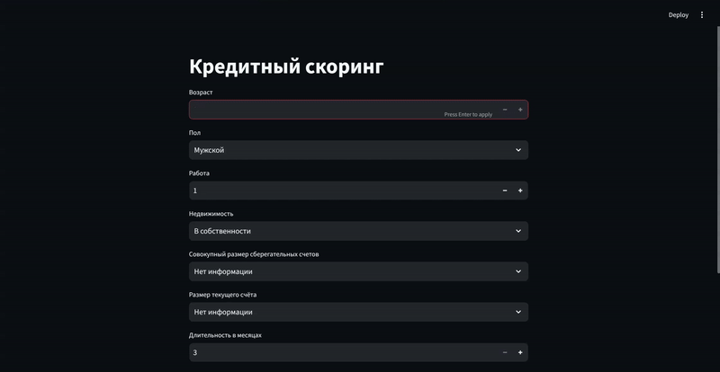

# Оценка кредитоспособности

Этот проект реализует модель машинного обучения для определения кредитоспособности физических лиц на основе нескольких предопределенных характеристик. Предоставлен пользовательский интерфейс для взаимодействия с моделью.



## Содержание

- [Установка](#установка)
- [Использование](#использование)
- [Данные](#данные)
- [Техническое описание](#техническое-описание)

## Установка

**Требования:**

- Python 3.12
- Anaconda или Conda [ссылка](https://github.com/conda/conda)

**Шаги установки с использованием conda и конфигурационного файла:**

1. Клонируйте репозиторий:
   ```bash
   git clone https://github.com/lpestov/credit_scoring.git
   ```
2. Перейдите в директорию проекта:
   ```bash
   cd credit_scoring/env
   ```
3. Создайте и активируйте conda-окружение с использованием конфигурационного файла `environment.yml`:
   ```bash
   conda env create --file environment.yml
   conda activate credit-scoring
   ```
4. Перейдите в директорию проекта:
   ```bash
   ..
   cd credit_scoring/src
   ```
5. Запустите пользовательский интерфейс:
   ```bash
   streamlit run UI.py
   ```
6. Убедитесь, что установленная версия scikit-learn корректна (рекомендуется scikit-learn 1.6.1). При необходимости обновите её:
   ```bash
   conda install scikit-learn=1.6.1
   ```

## Использование

Этот проект предназначен для оценки кредитоспособности физических лиц. После запуска интерфейса Streamlit пользователю будет представлена форма для ввода необходимых параметров. Модель затем выдаст прогноз, указывающий, одобрен ли кредит или нет.

## Данные

Для обучения и тестирования модели используется набор данных `german_credit_data.csv` [Kaggle](https://www.kaggle.com/datasets/uciml/german-credit), содержащий информацию о 1000 физических лицах. Для анализа используются следующие признаки:
- Age (numeric)
- Sex (text: male, female)
- Job (numeric: 0 - unskilled and non-resident, 1 - unskilled and resident, 2 - skilled, 3 - highly skilled)
- Saving accounts (text - little, moderate, quite rich, rich)
- Checking account (text - little, moderate, rich)
- Credit amount (numeric, in Deutsch Mark)
- Duration of credit (numeric, in month)
- Purpose (text: car, furniture/equipment, radio/TV, domestic appliances, repairs, education, business, vacation/others)

## Техническое описание

### Основные файлы проекта:
- [UI.py](src/UI.py)  
  Реализует веб-интерфейс с использованием Streamlit для сбора пользовательского ввода и отображения прогноза, который выполняется функцией `predict`.

- [input_processing.py](src/input_processing.py)  
  Содержит функцию для предварительной обработки данных пользовательского ввода перед передачей их модели для прогнозирования.

- [one_hot_encoder.joblib](models/one_hot_encoder.joblib)  
  Сохраненный one-hot кодировщик, используемый для категориальных признаков.

- [ordinal_encoder.joblib](models/ordinal_encoder.joblib)  
  Порядковый кодировщик для признака "Сберегательный счет".

- [scaler.joblib](models/scaler.joblib)  
  Сохраненный скелер для стандартизации данных.

### Описание решения:
- К категориальным признакам (`Sex`, `Housing`, `Checking account`, `Purpose`) применяется one-hot кодирование.
- Признак `Saving accounts` обрабатывается с использованием порядкового кодирования.
- Для определения кредитоспособности сравнивались 3 модели: Random Forest Classifier,Gradient Boosting Classifier, CatBoost. Настройка гиперпараметров выполнялась с использованием GridSearch.
- Лучшие результаты были достигнуты с моделью Gradient Boosting (ROC AUC: 0.764 на тестовом наборе данных).

Анализ данных, обучение и тестирование модели подробно описаны в блокноте [Credit_scoring_final.ipynb](notebooks/Credit_scoring_final.ipynb).